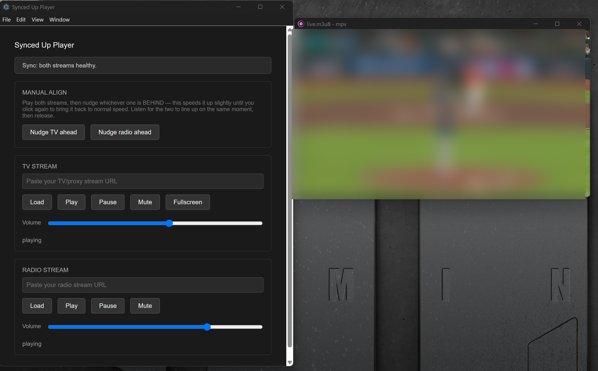

# Synced Up Player

[](LICENSE)
[](https://github.com/danowarr/synced-up-player/releases)
[](#getting-started)
[](https://www.electronjs.org/)

A local, on-device tool for keeping a TV stream and a radio broadcast
stream synchronized during a live sports game (or anything else where
you're watching one feed and listening to a separate commentary feed).
Bring-your-own-links — you provide the stream URLs, the app never
fetches, hosts, or rebroadcasts anything itself.

<!--
Add a real screenshot or short GIF here once you have one — this is
genuinely the single highest-impact thing you can add to this README.
Save it to docs/screenshot.png (or .gif) and uncomment the line below.
A quick screen recording of a sync session (stall-lock catching a
buffer, or the nudge-align in action) would say more than any amount
of prose.


-->

## Features

- Independent TV and radio playback (each its own mpv process)
- **Stall-lock**: when either stream buffers, the other pauses and waits
- **Local rolling buffer**: each stream is continuously re-recorded
  locally (via ffmpeg) into a 10-minute rolling window before playback,
  so pausing or catching up has real backlog to work with instead of
  hitting the upstream source's live edge after a few tens of seconds
- **Manual align**: nudge whichever stream is behind (temporary
  playback-speed increase) until they line up by ear
- Mute and volume on both streams; fullscreen on TV

## Getting started

**Just want to run it?** Grab a release (zip on Windows, tar.gz on
Linux) — mpv and ffmpeg are bundled in, nothing else to install.
Extract and run.

**Running from source, or building your own release?** You'll need
mpv/ffmpeg installed locally for development — see "Running from
source" below.

## Finding a stream URL to paste

This app needs a direct link to an HLS (`.m3u8`) stream for each side —
not a webpage URL. Most sites that embed a live video player don't show
you that link directly; it's a network request the page makes behind
the scenes to actually load the video. Two ways to find it:

**Browser DevTools** (works everywhere, nothing to install)

1. Open DevTools (F12, or Ctrl+Shift+I / Cmd+Option+I) and switch to
   the **Network** tab.
2. Filter by `m3u8`.
3. Start playing the video on the page.
4. Look for a request ending in `.m3u8` in the list — right-click it →
   **Copy → Copy link address**.
5. Paste that into this app.

**Browser extension** (faster, same underlying idea)

[m3u8 Sniffer TV](https://chromewebstore.google.com/detail/m3u8-sniffer-tv-find-and/akkncdpkjlfanomlnpmmolafofpnpjgn)
(Chrome Web Store) watches a page's network requests automatically and
surfaces any `.m3u8` URLs it finds in an overlay, so you don't have to
dig through the Network tab by hand. A similar
[Firefox extension](https://addons.mozilla.org/en-US/firefox/addon/m3u8-sniffer/)
exists too. Neither does anything this app doesn't already do
conceptually — they just automate the same lookup DevTools does
natively.

A few things worth knowing:

- Not every stream uses HLS/`.m3u8` — some use DASH (`.mpd`) instead,
  which this app doesn't currently handle; others are DRM-protected and
  won't work here at all (see "Scope" below — that's by design, not a
  bug).
- Radio stations often publish their stream URL directly and openly on
  their own site — no sniffing needed for those.
- This only works for content you already have legitimate access to and
  are already watching in your browser. Finding the URL your browser is
  already loading isn't meaningfully different from a browser's
  built-in "Copy Video Address" option on a plain `<video>` element —
  it's just the equivalent for players that don't expose that natively.

## Scope — what this deliberately does NOT do

This app only plays streams you provide a direct URL for. It does not:

- Fetch, decrypt, or interact with DRM-protected content in any way
- Capture audio/video from other applications or browser tabs
- Host, proxy, or rebroadcast any stream to anyone else

This keeps the app in the same legal category as a generic media
player (like VLC or mpv itself) rather than a rebroadcasting service.
If a stream requires DRM, this app simply won't play it — that's
expected, not a bug.

## Not yet implemented

- Persisted offset / automatic drift correction via audio fingerprinting
  — planned, once the manual-align workflow above has been well-tested
- No DRM support, by design — see "Scope" above
- **macOS** — not attempted. Apple's terms discourage running macOS in
  a VM outside their own hardware, so this needs testing on real Apple
  hardware rather than the way Linux support was verified. If you have
  a Mac and are interested in helping test/build this, that
  contribution would be genuinely useful — open an issue.

## Running from source

Only needed for development or building your own release — skip this
entirely if you just downloaded a bundled release (see "Getting
started" above).

### Prerequisites

- Node.js (18+)
- **mpv** — handles playback
  - macOS: `brew install mpv`
  - Debian/Ubuntu: `sudo apt install mpv`
  - Windows: a build from https://mpv.io/installation/
- **ffmpeg** — handles the local rolling buffer (recorder.js)
  - macOS: `brew install ffmpeg`
  - Debian/Ubuntu: `sudo apt install ffmpeg`
  - Windows: https://www.gyan.dev/ffmpeg/builds/ (the "essentials" build
    is fine)

Sanity check both work standalone before touching this app:
`mpv --no-video <some-stream-url>` should play audio, and
`ffmpeg -i <some-stream-url>` should print stream info without erroring.
If either fails standalone, nothing above it will work either.

### Setup

```
cd synced-up-player
npm install
```

Both mpv and ffmpeg need to be locatable. In order of priority, each is
looked up via:

1. A bundled binary at `resources/mpv/` or `resources/ffmpeg/` — only
   present in a packaged release build, not when running from source.
2. Environment variables — this is what you want for local development:
   ```
   # Windows (PowerShell)
   $env:MPV_BINARY_PATH="C:\path\to\mpv.exe"
   $env:FFMPEG_BINARY_PATH="C:\path\to\ffmpeg.exe"
   npm start

   # macOS/Linux
   MPV_BINARY_PATH=/path/to/mpv FFMPEG_BINARY_PATH=/path/to/ffmpeg npm start
   ```
3. Bare `mpv`/`ffmpeg` resolved via PATH — works if properly on PATH,
   but this has been the least reliable option in practice (Windows
   PATH edits don't apply to already-open terminals, in particular).

Once both are locatable, `npm start` opens the app. Paste a TV stream
URL and a radio stream URL into their respective sections and hit Load
— expect roughly 15-20 seconds before playback starts, since the app is
building a local buffer before mpv reads from it, not connecting
directly to your pasted URL.

## Building a release

Releases bundle the actual mpv/ffmpeg binaries so end users don't have
to install or configure anything (`resolveMpvBinary()`/
`resolveFfmpegBinary()` in main.js check for these first, before falling
back to the dev-mode env vars described above):

1. Drop the binaries in `vendor/mpv/<platform>/` and
   `vendor/ffmpeg/<platform>/` (see `vendor/README.md` for exact paths).
2. Note down exactly which build/version you used — required for the
   GPL "corresponding source" obligation, see
   `third-party-licenses/README.md`.
3. Build for whichever platform you're on:
   - `npm run dist:win` — produces a zip in `dist/`
   - `npm run dist:linux` — produces a tar.gz in `dist/`

   (Plain `npm run dist` auto-detects the current host platform. tar.gz
   was chosen over AppImage deliberately — AppImage needs FUSE
   installed on the user's system, which isn't present by default on
   several current distros; a plain tar.gz has no such dependency.)

Each platform's `extraResources` config (in package.json's `build`
section) pulls from its own `vendor/*/win/` or `vendor/*/linux/`
subfolder independently — building for one platform never touches the
other's binaries. `LICENSE`, `README.md`, and `third-party-licenses/`
are bundled into every release the same way.

**Windows will show a SmartScreen warning** ("Windows protected your
PC") when running the built .exe — expected for any unsigned binary
from a new publisher, not specific to this app. Some antivirus tools
may also flag it heuristically, specifically because it bundles
ffmpeg.exe/mpv.exe — a pattern some real malware droppers also use,
even though there's nothing to it here beyond that surface resemblance.
Click "More info" → "Run anyway" if you trust the source you got the
release from. Code-signing would reduce (not immediately eliminate)
this, but isn't worth the cost/verification overhead for early releases
of a free hobby project.

## How it fits together

```
your pasted URL
      |
      v
ffmpeg (recorder.js) --writes--> local rolling HLS buffer (10 min window)
                                          |
                          served over http://127.0.0.1:<port> (localServer.js)
                                          |
                                          v
                                    mpv (playback)
```

Two deliberate design choices worth knowing if you're reading the code:

- **Playback never points at your raw URL directly** — it always goes
  through the local recorder first. This is what makes stall-lock and
  manual-align actually useful instead of immediately hitting the
  upstream source's tiny live window.
- **The local buffer is served over HTTP, not read as a raw file path**
  — mpv/ffmpeg's HLS demuxer reliably reloads a *network* playlist to
  notice new segments, but doesn't reload a raw filesystem path the
  same way. Bound strictly to 127.0.0.1; nothing here is ever reachable
  from the network.

## Notes on other design choices

- `contextIsolation: true` / `nodeIntegration: false` in main.js is the
  standard secure Electron setup — the renderer never gets raw Node or
  mpv access, only the specific functions preload.js exposes.
- Each mpv instance (tv, radio) gets its own IPC pipe/socket and, for
  TV, a fixed screen position (`--geometry`) so its native video window
  doesn't spawn hidden behind the Electron control window.
- The stall-lock logic tracks real pause state (not just "did we issue
  a pause") specifically so a manual pause on one stream never gets
  silently auto-resumed later by the other stream recovering — see the
  comments around `pausedState`/`autoPaused` in main.js if extending
  this.
- Whether a source "looks like HLS" (recorder.js's `looksLikeM3U8`) is
  a URL-extension heuristic, not real content-type detection — good
  enough for the sources tested so far, documented as a known
  limitation in the code rather than something to over-engineer early.

## Licensing

This project's own code: MIT (see `LICENSE`). mpv and ffmpeg are
controlled as separate OS processes over IPC — never linked as
libraries — which is why this app's own license doesn't inherit their
GPL terms. If you build a release that BUNDLES the actual mpv/ffmpeg
binaries rather than requiring the user to install them, see
`third-party-licenses/README.md` for what that specifically requires.
